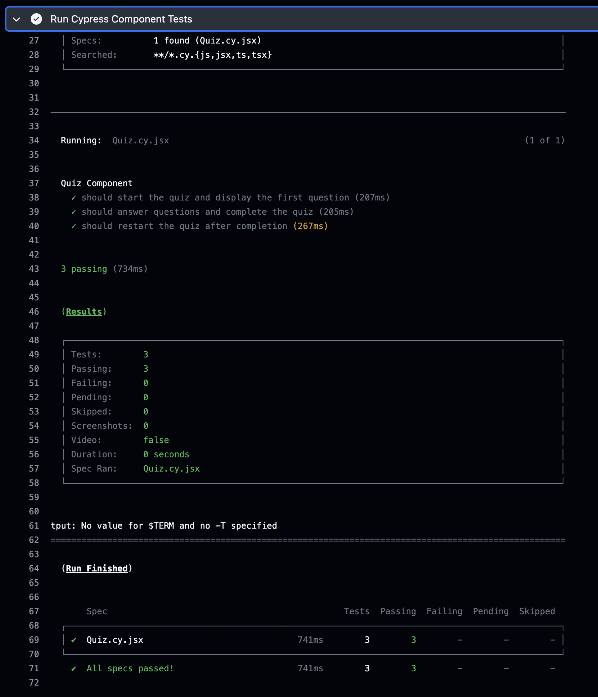
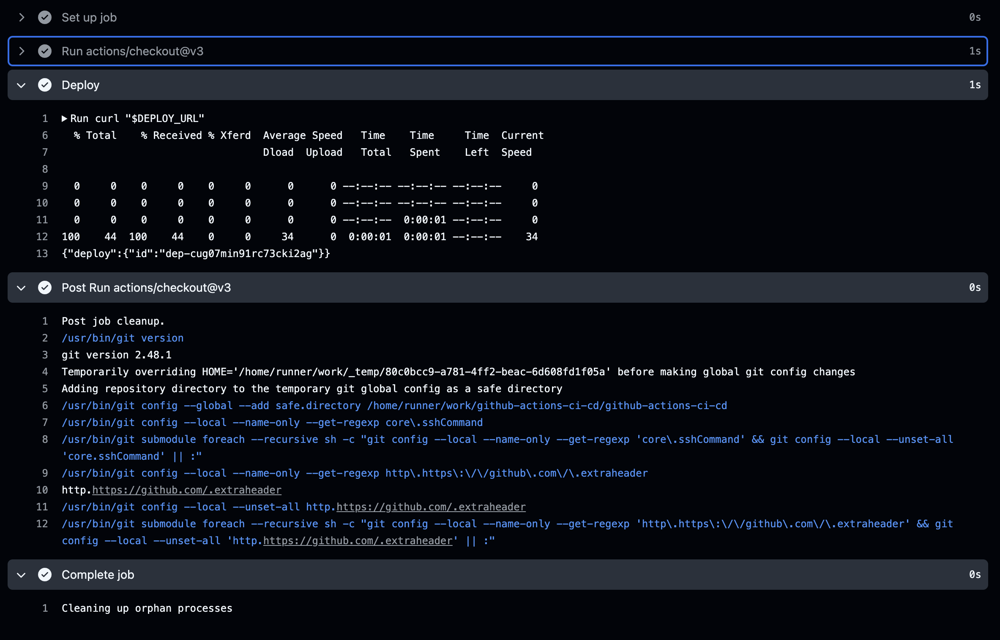
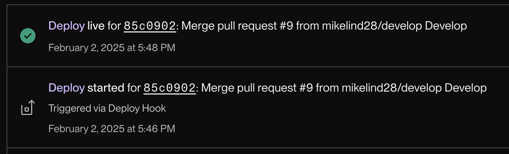

# Github Actions: CI/CD

## Description

This project was an exercise in taking an existing application and adding GitHub actions. The first action is triggered by making a pull request from a feature branch into the develop branch, and it runs Cypress component tests. The second action is triggered by making a pull request into the main branch, which automatically deploys the application to Render.

## Usage

When a pull request is made into the develop branch, it triggers a test from the .github/workflows/cypress-test.yml file. It runs the Cypress tests before the pull request is performed.

When a pull request is made into the main branch, it triggers a deploy hook to Render.

After the above test completes, a new Render deploy is activated, triggered via Deploy Hook.

## Credits

The existing code was provided by the full-stack coding bootcamp course through edX and the University of Minnesota. 

## License

This repository uses an [MIT License ↗️](./LICENSE.txt).
